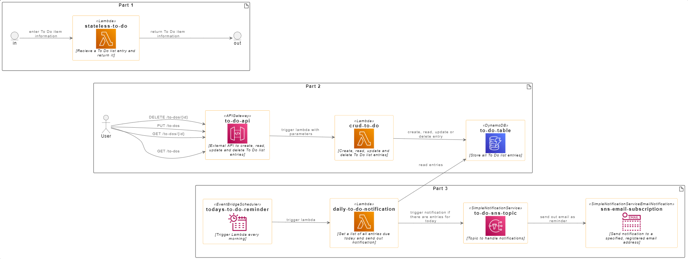

# cloud-to-do-app

The "Cloud To Do" app is a simple To Do List style application running on AWS.



This project contains source code and supporting files for a serverless application that you can deploy with the SAM CLI. It includes the following files and folders.
- lambda_functions - Code for the application's Lambda function.
  - stateless_to_do: A simple, stateless function which just returns the to do sent to it
  - crud_to_do: A Lambda storing and reading To Do entries using a DynamoDB table
  - daily_to_do_notification: A Lambda reading the DynamoDB table and sending out notifications about events due today.
- template.yaml - A template that defines the application's AWS resources.
  - IN PROGRESS: Not all required resources are yet defined in the template.yaml

The application uses several AWS resources, including Lambda functions and an API Gateway API. These resources are defined in the `template.yaml` file in this project. You can update the template to add AWS resources through the same deployment process that updates your application code.

## Build the application manually in the AWS Management Console
To build and deploy the the application manually, follow the instructions in 
[HowToOnAWS](./docs/HowToOnAWS.md)

## Deploy the application using SAM

:warning: This is still under construction and not yet completed!

The Serverless Application Model Command Line Interface (SAM CLI) is an extension of the AWS CLI that adds functionality for building and testing Lambda applications. It uses Docker to run  functions in an Amazon Linux environment that matches Lambda. It can also emulate an application's build environment and API.

To use the SAM CLI, you need the following tools.

* SAM CLI - [Install the SAM CLI](https://docs.aws.amazon.com/serverless-application-model/latest/developerguide/serverless-sam-cli-install.html)
* [Python 3 installed](https://www.python.org/downloads/)
* Docker - [Install Docker community edition](https://hub.docker.com/search/?type=edition&offering=community)

To build and deploy your application for the first time, run the following in your shell:

```bash
# build the source of the application
sam build --use-container

# package and deploy the application to AWS, with a series of prompts
sam deploy --guided
```

You can find your API Gateway Endpoint URL in the output values displayed after deployment.

## Use the SAM CLI to build and test locally

:warning: This is still under construction and not yet completed!

```bash
# build application
cloud-to-do-app$ sam build --use-container
```

The SAM CLI installs dependencies, creates a deployment package, and saves it in the `.aws-sam/build` folder.

Test a single function by invoking it directly with a test event. An event is a JSON document that represents the input that the function receives from the event source. Test events are included in the `events` folder in this project.

```bash
# run functions locally
cloud-to-do-app$ sam local invoke CrudToDoFunction --event events/event.json
```

The SAM CLI can also emulate your application's API. Use the `sam local start-api` to run the API locally on port 3000.

```bash
cloud-to-do-app$ sam local start-api
cloud-to-do-app$ curl http://localhost:3000/
```

## Cleanup

To delete the sample application that you created, use the AWS CLI. Assuming you used your project name for the stack name, you can run the following:

```bash
aws cloudformation delete-stack --stack-name cloud-to-do-app
```

