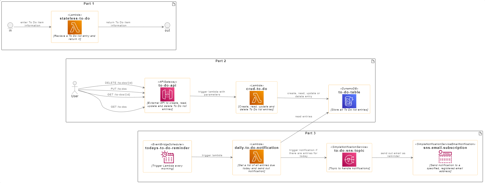
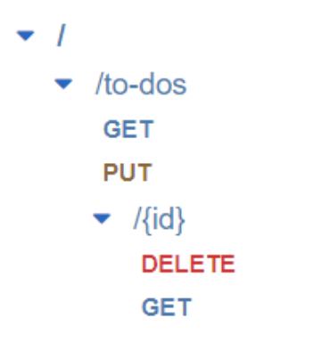

# Workshop instructions

Hints and instructions for the workshop 

> Leverage the Cloud to Deploy and Run your Backend App

hosted by [women++](https://www.womenplusplus.ch/), facilitated by [Iris Hunkeler](https://www.linkedin.com/in/iris-hunkeler/)

For more background and infos to the individual services, please check the [workshop slides](Slides_LeverageTheCloudToDeployAndRunYourBackendApp.pdf).

# Architecture
The instructions will take you through the steps to build the following architecture on AWS:

# Part 1

## Create a Lambda function
* Go to AWS Lambda → click “Create function”
* Settings
  * Select “Author from scratch”
  * Function name: e.g. stateless-to-do
  * Runtime: Python 3.10
  * Leave the rest at default settings
  * Click “Create function”
* Copy the code for the function: [stateless-to-do](../lambda_functions/stateless_to_do/app.py)
  * in the same folder, you can also find test events

# Part 2

## Create a new IAM role
* Go to IAM (Identity and Access Management)
* Go to Roles → Click “Create role”
* Step 1:
  * Trusted entity type: AWS service
  * Use Case: Lambda
* Step 2:
  * Search (separately) for AmazonDynamoDBFullAccess, CloudWatchFullAccess, AWSLambda_FullAccess and select the check box for each of them
* Step 3:
  * Role name: todo-lambda-role
  * Click “Create role”

## Create a DynamoDB table
* Go to DynamoDB → Click “Create table”
* Settings
  * Table name: to-do-table
  * Partition Key: id
  * Select Customize settings
  * Capacity mode “On-demand”
  * Click “Create table”

## Create a Lambda function
* Similar as before, but this time use the following settings: 
  * Function name: e.g. crud-to-do
  * Runtime: Python 3.10
  * Open “Change default execution role” and switch it to “Use an existing role”
  * Select our previously created “todo-lambda-role”
* Copy the code for the function: [crud-to-do](../lambda_functions/crud-to-do/app.py)
  * in the same folder, you can also find test events
  
## Create a API Gateway
* Go to API Gateway
* Click "Create API"
* Scroll to REST API and Click "Build"
  * API name: e.g. to-do-api
  * Click "Create API"
* Click Actions → Create Resource
  * Resource Name: To Dos
  * Resource Path: automatically set to “to-dos” based on name
  * Enable “Enable API Gateway CORS”
* Select “/to-dos” path → Click Actions → Create Method → Select GET in Dropdown
  * Integration Type: Lambda Function
  * Select “Use Lambda Proxy integration”
  * Lambda Function: select crud-to-dos
* Deploy API: Click Actions → Deploy API
  * Deployment stage: [New Stage]
  * Stage name: prod

Our goal is to have an API endpoint for each of the methods we handle in the Lambda function. That will look like the following:

# Part 3

## Create a Lambda function
* Create an other Lambda function, use the same settings and role as for the crud-to-do function
* Function name: e.g. daily-to-do-notification
* Copy the code for the function: [daily-to-do-notification](../lambda_functions/daily-to-do-notification/app.py)
  * in the same folder, you can also find test events

## Create an SNS topic and subscription
* **Topic**: Go to Simple Notification Service → Topics → Click “Create topic”
  * Type: Standard
  * Name: to-do-sns-topic
  * Display Name: To Do List
  * Leave the rest at default settings
  * Click “Create topic”
* **Subscription**: Click “Create subscription”
  * Topic ARN: Should be pre-selected automatically to the topic just created
  * Protocol: Email
  * Endpoint: Enter your email address
    * you can also use a service for throw-away-email-addresses such as [mailinator](https://www.mailinator.com/)
  * Click “Create subscription”

## Create a Scheduler
* Go to Amazon EventBridge → Schedules → Click “Create schedule”
* Step 1:
  * Schedule name: todays-to-do-reminder
  * Occurrence: Recurring schedule
  * Cron-based schedule: 
    * Minutes & Hours: Time of scheduler (e.g. now + 5 minutes)
    * Day of Month, Month and Year: *
    * Day of the week: ?
* Step 2:
  * Templated targets → AWS Lambda
  * Lambda function: daily-to-do-notification
* Step 3:
  * Turn off “Retry policy”
  * Permissions: Create a new role for this schedule
  * Review and Click “Create schedule”

# Clean up
To clean up, you can go through all the services we have used, select the created resources and Click "Delete" 
(sometimes you need to click "Actions" first).

Used services:
* Lambda
* DynamoDB
* API Gateway
* Simple Notification Service
* Scheduler
